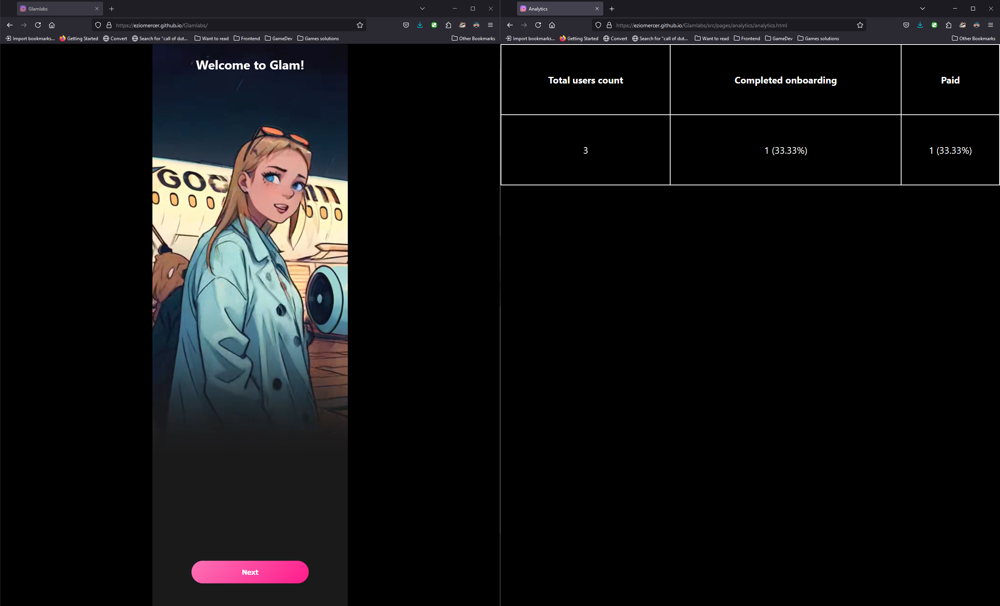

# Glamlabs

---

Link to onboarding: https://eziomercer.github.io/Glamlabs

Link to analytics: https://eziomercer.github.io/Glamlabs/src/pages/analytics/analytics.html

---

Fot better experience it is recommended to open two tabs as shown on picture:

Every time when you're entering to onboarding the new user automatically created

Just press the `Next` button and finish the onboarding (if you want)

At the end there will be a `Buy` button. If you click it will mean that you bought the product

The analytics on other screen will update automatically, no actions need